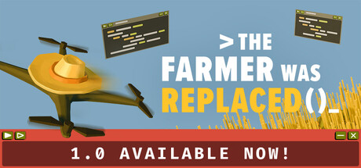

# Awesome Games for Software Engineers

A curated list of games that fits the style and thinking of Softwae Engineers.

## Table of Contents

* [Games](#games) (1 games)
  * [The Farmer Was Replaced](#the-farmer-was-replaced)
* [How to contribute](#how-to-contribute)
</ul>

## Games

<h3 id="the-farmer-was-replaced">The Farmer Was Replaced</h3>

Program and optimize a drone to automate a farm and watch it do the work for you. Collect resources to unlock better technology and become the most efficient farmer in the world. Improve your problem solving and coding skills.
* Genre: Casual, Indie, Simulation, Strategy, Early Access
* Release: Friday, 10 February 2023
* [The Farmer Was Replaced Website](https://www.metaroot.ch/press-kit/the-farmer-was-replaced)
* [The Farmer Was Replaced @ Steam](https://store.steampowered.com/app/2060160/)

----

## How to contribute

If you want to 
* add a new game to the list, check out our [Contribution Guide](/CONTRIBUTING.md)
* modify the tooling and structure, check out our [Development Guide](/DEVELOPMENT.md)
