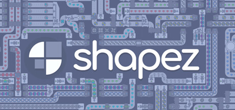
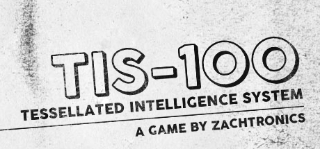

# Awesome Games for Software Engineers

A curated list of games for software engineers that have that certain something extra 👾 🎮

## Table of Contents

* [Games](#games) (15 games)
  * [7 Billion Humans](#7-billion-humans)
  * [Artifacts](#artifacts)
  * [Factorio](#factorio)
  * [Human Resource Machine](#human-resource-machine)
  * [Mindustry](#mindustry)
  * [Net.Attack()](#net-attack)
  * [Satisfactory](#satisfactory)
  * [Screeps: Arena](#screeps-arena)
  * [Screeps: World](#screeps-world)
  * [shapez](#shapez)
  * [shapez 2](#shapez-2)
  * [Sid Meier's Civilization IV](#sid-meiers-civilization-iv)
  * [SpaceTraders](#spacetraders)
  * [The Farmer Was Replaced](#the-farmer-was-replaced)
  * [TIS-100](#tis-100)
* [How to contribute](#how-to-contribute)
</ul>

## Games

<h3 id="7-billion-humans">7 Billion Humans</h3>

Automate swarms of office workers to solve puzzles inside your very own parallel computer made of people. A thrilling followup to the award winning Human Resource Machine. Now with more humans!
* Genre: Indie, Simulation
* Available for   
* Release: 
* [7 Billion Humans Website](http://tomorrowcorporation.com/7billionhumans)
* [7 Billion Humans @ Steam](https://store.steampowered.com/app/792100/)

----

<h3 id="artifacts">Artifacts</h3>

* Genre: 
* Available for 
* Release: 
* [Artifacts Website](https://www.artifactsmmo.com/)

----

<h3 id="factorio">Factorio</h3>

Factorio is a game about building and creating automated factories to produce items of increasing complexity, within an infinite 2D world. Use your imagination to design your factory, combine simple elements into ingenious structures, and finally protect it from the creatures who don&#39;t really like you.
* Genre: Casual, Indie, Simulation, Strategy
* Available for   
* Release: 
* [Factorio Website](https://www.factorio.com)
* [Factorio @ Steam](https://store.steampowered.com/app/427520/)

----

<h3 id="human-resource-machine">Human Resource Machine</h3>

Program little office workers to solve puzzles. Be a good employee! The machines are coming... for your job. From the creators of World of Goo and Little Inferno.
* Genre: Casual, Indie, Simulation
* Available for   
* Release: 
* [Human Resource Machine Website](http://tomorrowcorporation.com/humanresourcemachine)
* [Human Resource Machine @ Steam](https://store.steampowered.com/app/375820/)

----

<h3 id="mindustry">Mindustry</h3>

An open-ended factory management game with RTS and tower defense elements.
* Genre: Strategy
* Available for   
* Release: 

* [Mindustry @ Source Code Repository](https://github.com/Anuken/Mindustry)
* [Mindustry @ Steam](https://store.steampowered.com/app/1127400/)

----

<h3 id="net-attack">Net.Attack()</h3>

Unleash your inner hacker skills and code your way to victory in a game where complex algorithms and intuitive gameplay collide.Net.Attack() is a dynamic Top-Down Survivors-like Roguelite where you create your own abilities using programming.
* Genre: Action, Indie, Early Access
* Available for 
* Release: 
* [Net.Attack() Website](https://www.byterockers.games/)
* [Net.Attack() @ Steam](https://store.steampowered.com/app/3047370/)

----

<h3 id="satisfactory">Satisfactory</h3>

Satisfactory is a first-person open-world factory building game with a dash of exploration and combat. Play alone or with friends, explore an alien planet, create multi-story factories, and enter conveyor belt heaven!
* Genre: Adventure, Indie, Simulation, Strategy
* Available for 
* Release: 
* [Satisfactory Website](https://www.satisfactorygame.com/)
* [Satisfactory @ Steam](https://store.steampowered.com/app/526870/)

----

<h3 id="screeps-arena">Screeps: Arena</h3>

Screeps: Arena is an online RTS PvP strategy game for programming enthusiasts, wherein the core mechanic is programming your units AI. You write real JavaScript that fights autonomously against other players in a match-based arena environment.
* Genre: Indie, Simulation, Strategy, Early Access
* Available for   
* Release: 
* [Screeps: Arena Website](https://screeps.com)
* [Screeps: Arena @ Source Code Repository](https://github.com/screepers/screeps-arena-javascript-starter)
* [Screeps: Arena @ Steam](https://store.steampowered.com/app/1137320/)

----

<h3 id="screeps-world">Screeps: World</h3>

Screeps: World is an open source MMO RTS sandbox game for programming enthusiasts, wherein the core mechanic is programming your units AI. You control your colony by writing JavaScript which operates 24/7 in the single persistent open world filled by other players on par with you.
* Genre: Indie, Massively Multiplayer, Simulation, Strategy
* Available for   
* Release: 
* [Screeps: World Website](https://screeps.com)
* [Screeps: World @ Source Code Repository](https://github.com/screeps/screeps)
* [Screeps: World @ Steam](https://store.steampowered.com/app/464350/)

----

<h3 id="shapez">shapez</h3>

shapez is an easy-going, minimalistic factory building game about the automation of shapes through extraction and satisfying production lines. Adapt to increasingly complex shapes and grow your factory across an infinitely expanding map. Your only limitation is your creativity!
* Genre: Casual, Indie, Simulation, Strategy
* Available for   
* Release: 
* [shapez Website](https://shapez.io)
* [shapez @ Source Code Repository](https://github.com/tobspr-games/shapez.io)
* [shapez @ Steam](https://store.steampowered.com/app/1318690/)

----

<h3 id="shapez-2">shapez 2</h3>

Dive into a factory-building game with the focus on just that – building huge space factories! Construct sprawling multi-level factories and satisfying production lines without limits. Tackle increasingly complex automation challenges at your own pace – you won’t have to worry about enemies.
* Genre: Casual, Indie, Simulation, Strategy, Early Access
* Available for   
* Release: 
* [shapez 2 Website](https://tobspr.io)
* [shapez 2 @ Steam](https://store.steampowered.com/app/2162800/)

----

<h3 id="sid-meiers-civilization-iv">Sid Meier&#39;s Civilization IV</h3>

With over 6 million units sold and unprecedented critical acclaim from fans and press around the world, Sid Meier&#39;s Civilization is recognized as one of the greatest PC game franchises of all-time. Now, Sid Meier and Firaxis Games will take this incredibly fun and addictive game to new heights by adding new ways to play and win, new...
* Genre: Strategy
* Available for  
* Release: 
* [Sid Meier&#39;s Civilization IV Website](http://www.2kgames.com/civ4/home.htm)
* [Sid Meier&#39;s Civilization IV @ Steam](https://store.steampowered.com/app/3900/)

----

<h3 id="spacetraders">SpaceTraders</h3>

* Genre: 
* Available for 
* Release: 
* [SpaceTraders Website](https://spacetraders.io/)
* [SpaceTraders @ Source Code Repository](https://github.com/SpaceTradersAPI/api-docs)

----

<h3 id="the-farmer-was-replaced">The Farmer Was Replaced</h3>

Program and optimize a drone to automate a farm and watch it do the work for you. Collect resources to unlock better technology and become the most efficient farmer in the world. Improve your problem solving and coding skills.
* Genre: Casual, Indie, Simulation, Strategy, Early Access
* Available for 
* Release: 
* [The Farmer Was Replaced Website](https://www.metaroot.ch/press-kit/the-farmer-was-replaced)
* [The Farmer Was Replaced @ Steam](https://store.steampowered.com/app/2060160/)

----

<h3 id="tis-100">TIS-100</h3>

TIS-100 is an open-ended programming game by Zachtronics, the creators of SpaceChem and Infinifactory, in which you rewrite corrupted code segments to repair the TIS-100 and unlock its secrets. It’s the assembly language programming game you never asked for!
* Genre: Indie, Simulation
* Available for   
* Release: 
* [TIS-100 Website](http://www.zachtronics.com/tis-100)
* [TIS-100 @ Steam](https://store.steampowered.com/app/370360/)

----

## How to contribute

If you want to 
* add a new game to the list, check out our [Contribution Guide](/CONTRIBUTING.md)
* modify the tooling and structure, check out our [Development Guide](/DEVELOPMENT.md)
