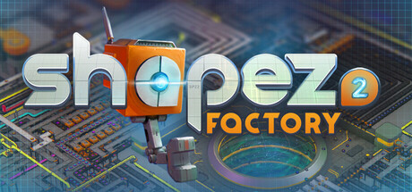
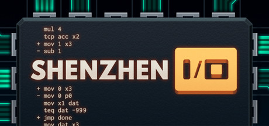

# Awesome Games for Software Engineers

A curated list of games for software engineers that have that certain something extra 👾 🎮

**Notes**

* `Programmable: Yes 🤖` means: The game or the game client/actions can be controlled by code. Get creative 👩‍🎨

## Table of Contents

* [Games](#games) (17 games)
  * [7 Billion Humans](#7-billion-humans)
  * [Artifacts](#artifacts)
  * [Factorio](#factorio)
  * [Human Resource Machine](#human-resource-machine)
  * [JOY OF PROGRAMMING - Software Engineering Simulator](#joy-of-programming-software-engineering-simulator)
  * [Mindustry](#mindustry)
  * [Net.Attack()](#net-attack)
  * [Satisfactory](#satisfactory)
  * [Screeps: Arena](#screeps-arena)
  * [Screeps: World](#screeps-world)
  * [shapez](#shapez)
  * [shapez 2](#shapez-2)
  * [SHENZHEN I/O](#shenzhen-i-o)
  * [Sid Meier&#39;s Civilization IV](#sid-meiers-civilization-iv)
  * [SpaceTraders](#spacetraders)
  * [The Farmer Was Replaced](#the-farmer-was-replaced)
  * [TIS-100](#tis-100)
* [Still not enough?](#still-not-enough)
* [How to contribute](#how-to-contribute)
</ul>

## Games

<h3 id="7-billion-humans">7 Billion Humans</h3>

Automate swarms of office workers to solve puzzles inside your very own parallel computer made of people. A thrilling followup to the award winning Human Resource Machine. Now with more humans!
* Genre: Indie, Simulation
* Available for   
* Release: Thursday, 23. August 2018
* [Website of 7 Billion Humans](http://tomorrowcorporation.com/7billionhumans)
* [7 Billion Humans @ Steam](https://store.steampowered.com/app/792100/)

----

<h3 id="artifacts">Artifacts</h3>

Artifacts is a sandbox MMORPG designed for code lovers, where you control your characters entirely through an HTTP API. Every action your characters can take corresponds to an endpoint you can interact with programmatically. This unique approach lets you automate gameplay, build custom tools, and explore new ways to play. It has no predetermined path — you choose your own adventure. Send your characters into combat against monsters, gather resources using skills like mining and woodcutting, craft equipment, complete quests, and much more.
* Genre: Programming, Massively Multiplayer, Strategy
* Programmable: Yes 🤖
* Available for   
* [Website of Artifacts](https://www.artifactsmmo.com/)

----

<h3 id="factorio">Factorio</h3>

Factorio is a game about building and creating automated factories to produce items of increasing complexity, within an infinite 2D world. Use your imagination to design your factory, combine simple elements into ingenious structures, and finally protect it from the creatures who don&#39;t really like you.
* Genre: Casual, Indie, Simulation, Strategy
* Available for   
* Release: Friday, 14. August 2020
* [Website of Factorio](https://www.factorio.com)
* [Factorio @ Steam](https://store.steampowered.com/app/427520/)

----

<h3 id="human-resource-machine">Human Resource Machine</h3>

Program little office workers to solve puzzles. Be a good employee! The machines are coming... for your job. From the creators of World of Goo and Little Inferno.
* Genre: Casual, Indie, Simulation
* Available for   
* Release: Thursday, 15. October 2015
* [Website of Human Resource Machine](http://tomorrowcorporation.com/humanresourcemachine)
* [Human Resource Machine @ Steam](https://store.steampowered.com/app/375820/)

----

<h3 id="joy-of-programming-software-engineering-simulator">JOY OF PROGRAMMING - Software Engineering Simulator</h3>

Use real Python code to automate machines, robots, drones and more: Program self-driving vehicles; crack passwords; apply machine learning; automate logistics; use image processing to guide missiles. Gain real coding skills and solve exciting bite-sized programming challenges.
* Genre: Indie, Simulation, Strategy
* Available for 
* Release: Saturday, 18. January 2025
* [JOY OF PROGRAMMING - Software Engineering Simulator @ Steam](https://store.steampowered.com/app/2216770/)

----

<h3 id="mindustry">Mindustry</h3>

An open-ended factory management game with RTS and tower defense elements.
* Genre: Strategy
* Available for   
* Release: Thursday, 26. September 2019
* [Website of Mindustry](https://mindustrygame.github.io/)
* [Source Code for Mindustry @ Source Code Repository](https://github.com/Anuken/Mindustry)
* [Mindustry @ Steam](https://store.steampowered.com/app/1127400/)

----

<h3 id="net-attack">Net.Attack()</h3>

Unleash your inner hacker skills and code your way to victory in a game where complex algorithms and intuitive gameplay collide.Net.Attack() is a dynamic Top-Down Survivors-like Roguelite where you create your own abilities using programming.
* Genre: Action, Indie, Early Access
* Available for 
* Release: Thursday, 19. June 2025
* [Website of Net.Attack()](https://www.byterockers.games/)
* [Net.Attack() @ Steam](https://store.steampowered.com/app/3047370/)

----

<h3 id="satisfactory">Satisfactory</h3>

Satisfactory is a first-person open-world factory building game with a dash of exploration and combat. Play alone or with friends, explore an alien planet, create multi-story factories, and enter conveyor belt heaven!
* Genre: Adventure, Indie, Simulation, Strategy
* Available for 
* Release: Tuesday, 10. September 2024
* [Website of Satisfactory](https://www.satisfactorygame.com/)
* [Satisfactory @ Steam](https://store.steampowered.com/app/526870/)

----

<h3 id="screeps-arena">Screeps: Arena</h3>

Screeps: Arena is an online RTS PvP strategy game for programming enthusiasts, wherein the core mechanic is programming your units AI. You write real JavaScript that fights autonomously against other players in a match-based arena environment.
* Genre: Indie, Simulation, Strategy, Early Access
* Programmable: Yes 🤖
* Available for   
* Release: Thursday, 07. April 2022
* [Website of Screeps: Arena](https://screeps.com)
* [Source Code for Screeps: Arena @ Source Code Repository](https://github.com/screepers/screeps-arena-javascript-starter)
* [Screeps: Arena @ Steam](https://store.steampowered.com/app/1137320/)

----

<h3 id="screeps-world">Screeps: World</h3>

Screeps: World is an open source MMO RTS sandbox game for programming enthusiasts, wherein the core mechanic is programming your units AI. You control your colony by writing JavaScript which operates 24/7 in the single persistent open world filled by other players on par with you.
* Genre: Indie, Massively Multiplayer, Simulation, Strategy
* Programmable: Yes 🤖
* Available for   
* Release: Wednesday, 16. November 2016
* [Website of Screeps: World](https://screeps.com)
* [Source Code for Screeps: World @ Source Code Repository](https://github.com/screeps/screeps)
* [Screeps: World @ Steam](https://store.steampowered.com/app/464350/)

----

<h3 id="shapez">shapez</h3>

shapez is an easy-going, minimalistic factory building game about the automation of shapes through extraction and satisfying production lines. Adapt to increasingly complex shapes and grow your factory across an infinitely expanding map. Your only limitation is your creativity!
* Genre: Casual, Indie, Simulation, Strategy
* Available for   
* Release: Sunday, 07. June 2020
* [Website of shapez](https://shapez.io)
* [Source Code for shapez @ Source Code Repository](https://github.com/tobspr-games/shapez.io)
* [shapez @ Steam](https://store.steampowered.com/app/1318690/)

----

<h3 id="shapez-2">shapez 2</h3>

Dive into a factory-building game with the focus on just that – building huge space factories! Construct sprawling multi-level factories and satisfying production lines without limits. Tackle increasingly complex automation challenges at your own pace – you won’t have to worry about enemies.
* Genre: Casual, Indie, Simulation, Strategy, Early Access
* Available for   
* Release: Thursday, 15. August 2024
* [Website of shapez 2](https://tobspr.io)
* [shapez 2 @ Steam](https://store.steampowered.com/app/2162800/)

----

<h3 id="shenzhen-i-o">SHENZHEN I/O</h3>

BUILD CIRCUITS. WRITE CODE. RTFM.
* Genre: Indie, Simulation
* Available for   
* Release: Thursday, 17. November 2016
* [Website of SHENZHEN I/O](http://www.zachtronics.com/shenzhen-io/)
* [SHENZHEN I/O @ Steam](https://store.steampowered.com/app/504210/)

----

<h3 id="sid-meiers-civilization-iv">Sid Meier&#39;s Civilization IV</h3>

With over 6 million units sold and unprecedented critical acclaim from fans and press around the world, Sid Meier&#39;s Civilization is recognized as one of the greatest PC game franchises of all-time. Now, Sid Meier and Firaxis Games will take this incredibly fun and addictive game to new heights by adding new ways to play and win, new...
* Genre: Strategy
* Available for  
* Release: Wednesday, 25. October 2006
* [Website of Sid Meier&#39;s Civilization IV](http://www.2kgames.com/civ4/home.htm)
* [Sid Meier&#39;s Civilization IV @ Steam](https://store.steampowered.com/app/3900/)

----

<h3 id="spacetraders">SpaceTraders</h3>

SpaceTraders is a space-themed economic game with HTTP endpoints for automating gameplay and building custom tools (A programmable API game for developers). It is an open-universe space-themed game that offers a set of HTTP endpoints to control a fleet of ships. All players operate their fleet in the same universe. Unlike a traditional game, SpaceTraders is headless and does not have a first-party client to play the game. Instead, you as the player are responsible for building your own client to interact with the API. This allows you to build your own UI, automate your trade routes, or just play the game from the comfort of your terminal.
* Genre: Programming, Strategy, Simulation
* Programmable: Yes 🤖
* Available for   
* [Website of SpaceTraders](https://spacetraders.io/)
* [Source Code for SpaceTraders @ Source Code Repository](https://github.com/SpaceTradersAPI/api-docs)

----

<h3 id="the-farmer-was-replaced">The Farmer Was Replaced</h3>

Program and optimize a drone to automate a farm and watch it do the work for you. Collect resources to unlock better technology and become the most efficient farmer in the world. Improve your problem solving and coding skills.
* Genre: Casual, Indie, Simulation, Strategy, Early Access
* Available for 
* Release: Friday, 10. February 2023
* [Website of The Farmer Was Replaced](https://www.metaroot.ch/press-kit/the-farmer-was-replaced)
* [The Farmer Was Replaced @ Steam](https://store.steampowered.com/app/2060160/)

----

<h3 id="tis-100">TIS-100</h3>

TIS-100 is an open-ended programming game by Zachtronics, the creators of SpaceChem and Infinifactory, in which you rewrite corrupted code segments to repair the TIS-100 and unlock its secrets. It’s the assembly language programming game you never asked for!
* Genre: Indie, Simulation
* Available for   
* Release: Monday, 20. July 2015
* [Website of TIS-100](http://www.zachtronics.com/tis-100)
* [TIS-100 @ Steam](https://store.steampowered.com/app/370360/)

----

## Still not enough?

Take a look at [Awesome Engineering Games](https://github.com/arcataroger/awesome-engineering-games) (incl. the related [HackerNews discussion](https://news.ycombinator.com/item?id=38336688)) or at [Awesome Programming Games](https://github.com/readyready15728/awesome-programming-games).

## How to contribute

If you want to 
* add a new game to the list, check out our [Contribution Guide](/CONTRIBUTING.md)
* modify the tooling and structure, check out our [Development Guide](/DEVELOPMENT.md)
